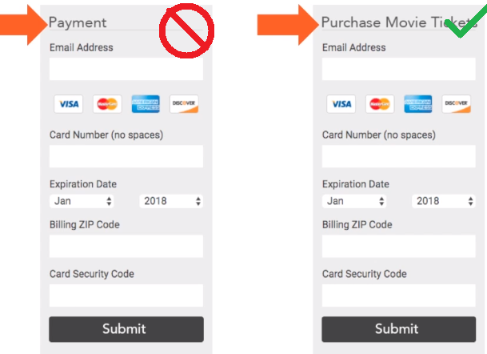
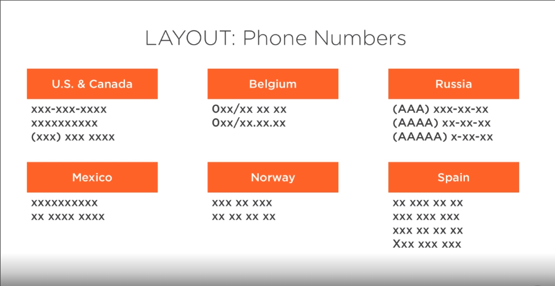
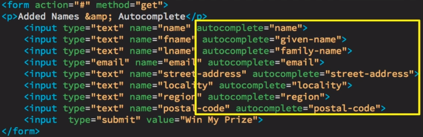
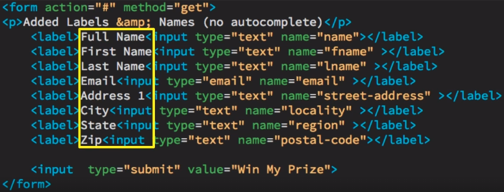
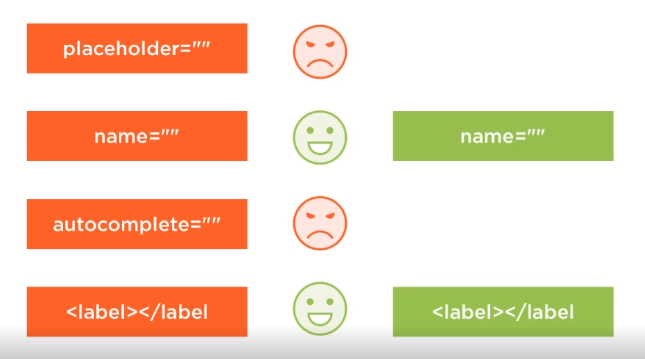
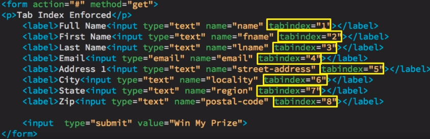
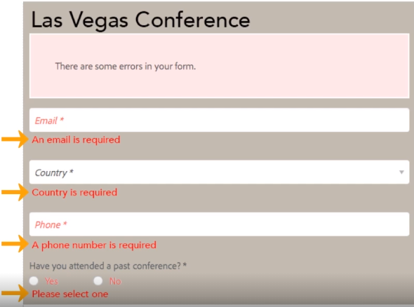
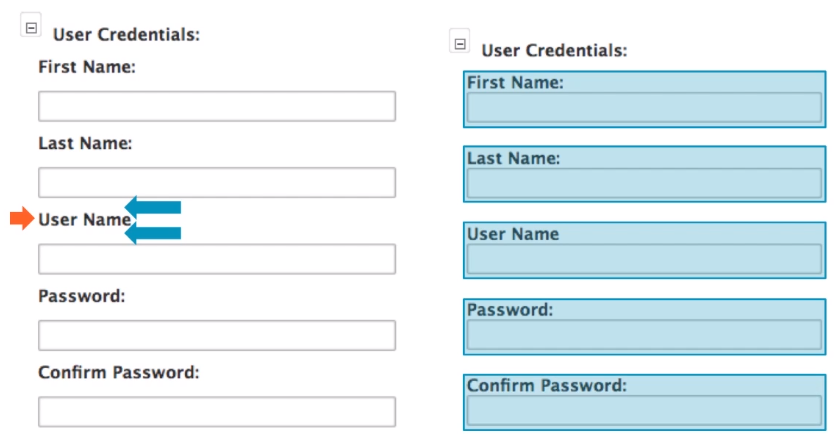
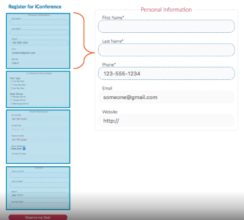

# 24 Best Practices

## Labeling

1. Title your form with the users' needs and goals in mind.
   

1. Never use the word "submit".

   - Instead, use a word or phrase that describes what the used wants to do. (i.e. Purchase Tickets, Purchase My tickets, Send, etc.)

## Content

1. Remove unnecessary questions

   - Unnecessary questions may appear as Data Mining to users.

1. Clearly identify required fields.

   - Example, mark required fields with a red asterisk.
   - A red border also is a viable marker.

## Layout

1. Place labels above and left aligned

   - Maintain as straight of an 'eye path' as possible for easy of reading.

1. Never use multiple columns for a form.

1. Use a single input for a phone number.

   - Phone numbers around the world use many different formats and you need to allow for them.
     
   - Validation can be done using REGEX/pattern matching if required.

1. Use multiple step forms for longer processes.

   - Implement a progress indicator and forward/back buttons

1. Use radio buttons for 5 or less options and use a dropdown for more than 5 options.

## Inputs

1. Use placeholder text to reduce confusion.
   - Should not be used to replace labels.
1. Design forms to autofill
   

   - Reference the [W3C Recommendation](https://www.w3.org/TR/html52/sec-forms.html#sec-autofill) for a full list.
   - You can also label your inputs to match the standard and autofill will work without extra setup.
     - This also ensures 100% autofill success (in modern browsers).
   - W3C also recommends wrapping your inputs inside of their labels
     
   - use the name attribute combined with appropriate labels to maximize auto fill.
     

1. Make sure the 'Tab' key works

   - This is important for accessibility.
   - Single column forms should be taken care of automatically.
   - For more complex forms use the 'tabindex' attribute.
     

1. Order choices logically

   - If no obvious logical ordering is available, use 'ABC' ordering.

1. Wrap all inputs in labels (as mentioned above in #2)
   - helps with touching small items like radio-buttons and checkboxes.

## Submission

1. Never add a reset button to your page.

   - The risk of an accidental click is too high to justify the need.
   - The same functionality can be achieved by refreshing the page.

2. Show a confirmation page.

## Errors

1. Show any validation errors inline.
   

1. Don't make the validation too strict.
   - Could discourage form completion.
   - Instead validate the bare minium and reformat on the backend prior to saving the data.

## Design

1. Beautiful design inspires confidence

1. Use high contrast for sunny days

   - With the rise of mobile device use, glare from the sun could make the format hard to read and discourage form completion.

1. Minimum height of 44px (for elements that need to be touched on mobile devices).

1. Input text size should be at least 16px

1. Group related information
   

1. Chunk large forms using field-sets.
   
